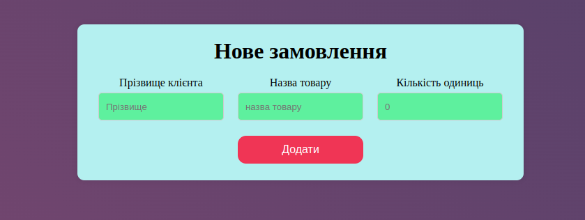
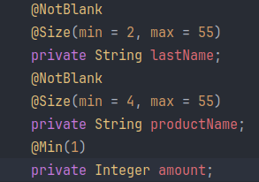
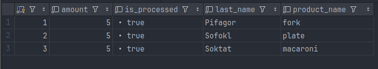

# Test Task  Web Application

## Overview
This is a microservice for saving orders to the database (db) and sending them to the other microservices. 
Once at 5 minutes, these orders are taken and sent to the queue for further processing.
Order is taken from JSP form and the result of the action should be printed by alert() JS - function. OK and object with errors respectively.
Orders are saved in SQL db, and after they are sent to the queue they are marked as processed to prevent further selection of already processed orders.

## Challenges
 - Firstly, search for correct maven dependencies.
 - On the second place, JSP page settings with JS scripts and styles that must work properly with Spring boot.
 - The last one was to put .war archive into the docker image.


## Technologies Used
- **Java 17**: The primary programming language used for the backend development.
- **Spring Boot**: 3.3.2.
- **Spring Data JPA**:  provides repository support for the Jakarta Persistence API (JPA).
- **Postgres**: Database for storing orders.
- **Maven**: Build automation tool used for managing dependencies and building the project.
- **Docker**: Used for containerizing the application to ensure consistent environments across development and production.
- **Docker Compose**: Tool for defining and running multi-container Docker applications.
- **GitHub Actions**: For CI/CD to automate the build and deployment process.
- **Test container**: To test the same database as the application will use.
- **Checkstyle**: Code analysis tool to ensure code quality and adherence to coding standards.

## Project Structure
 - src/: Contains the source code of the application.
 - Dockerfile: Instructions for building the Docker image.
 - docker-compose.yml: Configuration for Docker Compose to run the application and its dependencies.
 - pom.xml: Maven configuration file.

## Getting Started

### Prerequisites
- Java 17 
- Maven 3.8+
- Docker
- Docker Compose 

### Installation

1. Clone the repository from ssh:
   ```sh
   git clone git@github.com:MolchanovAlexander/Test-PB-Task.git

2. Create .env file in root directory with test data
      ```plaintext
    # PostgreSQL
   POSTGRES_USER=rootu
   POSTGRES_PASSWORD=rootp
   POSTGRES_DATABASE=orderdb
   POSTGRES_LOCAL_PORT=5433
   POSTGRES_DOCKER_PORT=5432
   
   # Spring Boot Application
   SPRING_LOCAL_PORT=8088
   SPRING_DOCKER_PORT=8080


3. Build the application:

    ```sh
    mvn clean install
   
### Usage

1. Run the application using Docker Compose:
    ```sh
    docker-compose up --build

2. Access the application at http://localhost:8088/orders via browser and you see this form.
   

3. Enter valid input due to these restrictions:

   

4. If your inputs will have invalid data you will see details in alert window.


5. This table represents order and has a boolean field "is_processed" 
to prevent selection after sending these orders to the queue.
   